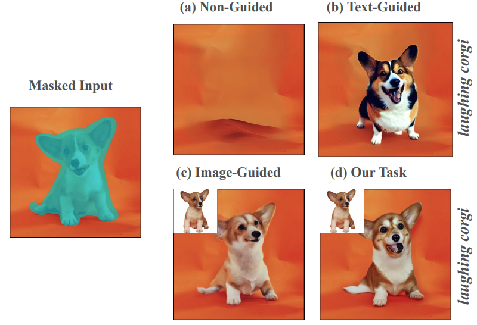

<section class="hero-section" id="about">
  

    <h1>Shaoan Xie</h1>
    
Generative AI Researcher

    

      Multimodal Generation
      Image &amp; Video
      Diffusion Models
      Post-training &amp; RL
    

    
My research focuses on building multimodal generative models that can generate, reason, and learn from feedback while remaining controllable and generalizable.

    

      <a href="https://scholar.google.com/citations?user=mChB-hQAAAAJ&amp;hl=en&amp;oi=ao"><i class="ai ai-google-scholar" aria-hidden="true"></i>Google Scholar</a>
      <a href="https://github.com/Mid-Push"><i class="fab fa-github" aria-hidden="true"></i>GitHub</a>
      <a href="https://www.linkedin.com/in/shaoan-xie-9b24201a7/"><i class="fab fa-linkedin" aria-hidden="true"></i>LinkedIn</a>
      <a href="mailto:shaoan@cmu.edu"><i class="far fa-envelope" aria-hidden="true"></i>Email</a>
    

  

  

    

      <figure class="noise-stage">
        

        <figcaption>Gaussian Noise</figcaption>
      </figure>

      <svg class="pipeline-arrow" viewBox="0 0 38 24" aria-hidden="true"><path d="M2 12h29M23 4l8 8-8 8"></path></svg>

      <figure class="diffusion-stage">
        

          
          
          
          
          
        

        <figcaption>Diffusion Process</figcaption>
      </figure>

      <svg class="pipeline-arrow" viewBox="0 0 38 24" aria-hidden="true"><path d="M2 12h29M23 4l8 8-8 8"></path></svg>

      

        <figure class="output-card">
          
          <figcaption>Image Generation</figcaption>
        </figure>
        <figure class="output-card output-motion">
          
          <i class="fas fa-play"></i>
          <figcaption>Generative Editing</figcaption>
        </figure>
      

    

  

</section>

<section class="featured-section" id="featured-research">
  

    <h2>Featured Research</h2>
    <a href="#publications">View all publications →</a>
  

  
</section>

<section class="credibility-strip" id="research-impact" aria-label="Research highlights">
  <article class="credibility-item">
    
<i class="fas fa-chart-line" aria-hidden="true"></i>

    
<strong>Product Impact</strong>SmartBrush integrated into Adobe Photoshop and Firefly

  </article>
  <article class="credibility-item">
    
<i class="fas fa-trophy" aria-hidden="true"></i>

    
<strong>Research Recognition</strong>CVPR 2023/2025 Highlights &nbsp;•&nbsp; ICLR 2023 Spotlight

  </article>
  <article class="credibility-item">
    
<i class="fas fa-users" aria-hidden="true"></i>

    
<strong>Research Leadership</strong>ICLR ’26 &amp; ’27 Area Chair &nbsp;•&nbsp; NeurIPS ’26 Area Chair

  </article>
</section>

<section class="content-section news-section" id="news">
  

    <h2>News</h2>
  

  <ul class="news-list">
    <li><time>Jul. 2026</time>A paper on <a href="https://openreview.net/pdf?id=0T1Pd65fyD">counterfactual prediction</a> was accepted to <em>TMLR</em>. Two papers were accepted to <em>ECCV 2026</em>: <a href="https://arxiv.org/pdf/2512.10720">interpreting and controlling text-to-image models</a> and <a href="https://arxiv.org/pdf/2607.00858">long video-text alignment</a>.</li>
    <li><time>Apr. 2026</time>Papers were accepted to <em>ICLR 2026</em> and <em>CVPR 2026</em>, and our work on <a href="assets/files/shaoan_dllm.pdf">post-training diffusion language models with denoising-process rewards</a> was accepted to <em>ACL 2026 Main</em>.</li>
    <li><time>Sep. 2025</time>My work was featured by <a href="https://www.cmu.edu/news/stories/archives/2025/september/peacocks-eating-ice-cream-cmu-philosophers-teaching-ai-to-ask-why">CMU News</a> and <a href="https://mbzuai.ac.ae/news/create-and-edit-images-like-a-smart-artist/">MBZUAI News</a>.</li>
    <li><time>Aug. 2025</time>I will serve as an Area Chair for <a href="https://iclr.cc/">ICLR 2026</a>.</li>
    <li><time>May 2025</time>Two papers were accepted to <a href="https://icml.cc/">ICML 2025</a>.</li>
    <li><time>Apr. 2025</time>SmartCLIP was selected as a <a href="https://cvpr.thecvf.com/">CVPR 2025 Highlight</a>.</li>
  </ul>
</section>

<section class="content-section publications-section" id="publications">
  

    <h2>Publications</h2>
    <a href="https://scholar.google.com/citations?user=mChB-hQAAAAJ&amp;hl=en&amp;oi=ao">Google Scholar ↗</a>
  

  
</section>

<section class="content-section services-section" id="services">
  

    <h2>Academic Service</h2>
  

  
</section>
